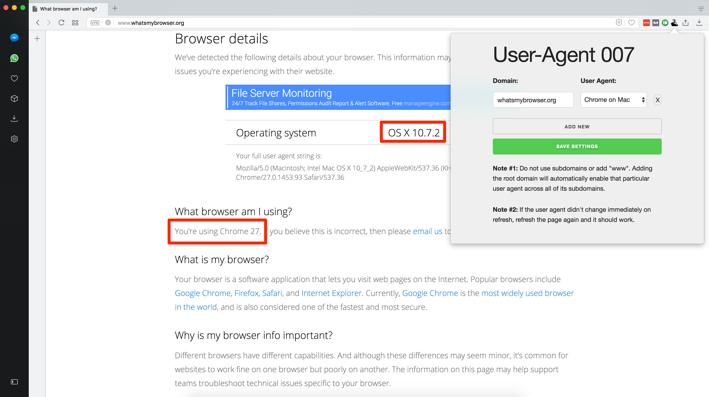
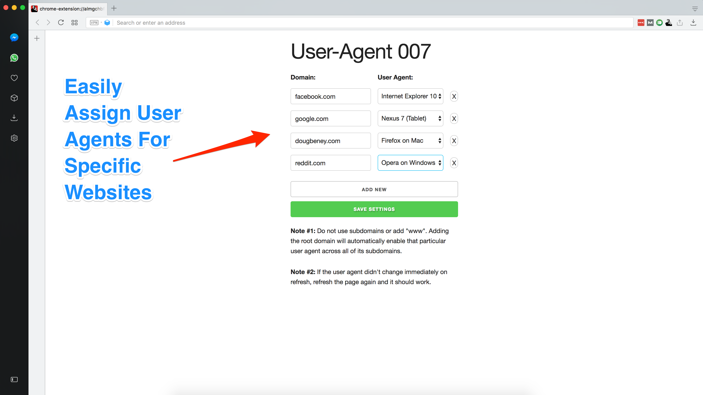
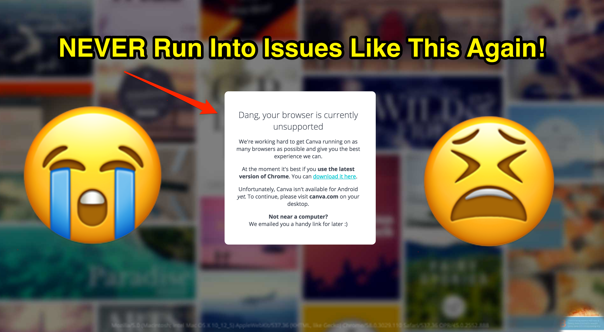

# User-Agent 007

Tired of having to switch over to another browser just to access a specific web app that doesn't support Opera?

So was I! Then, I created User-Agent 007.

**This extension is even cool than it's name!**

Use this extension to easily assign user-agents to specific websites.

[Download On The Opera Web Store](#) (Coming Soon!)

## Screenshots

[Download On The Opera Web Store](#) (Coming Soon!)

These 🔥 lines of code were carefully created by [Doug Beney](https://dougbeney.com/)
